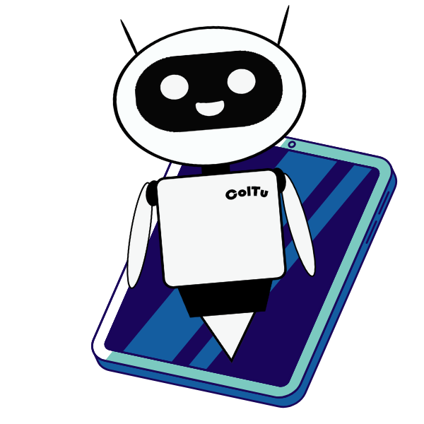

# Projeto Coltu

> Em um desafio da Rocket Seat, fomos chamados a pensar numa solução para: "Pensando em construir o futuro, como você solucionaria os problemas de acesso à educação hoje, utilizando a tecnologia?". Assim surgiu a ideia de Coltu! Uma inteligencia artificial integrada a um aparelho semelhante a um tablete, onde as pessoas poderão por voz, gestos, imagem, digitação, pedir informações sobre algum assunto. poderão também integrar a escola, faculdade, curso e abrir as aulas, fazer trabalhos e muito mais! Tudo isso conectado a tecnologia 5g que possibilitará uma conexão mais estável e barata. Coltu veio para quebrar todas as barreiras de acesso à educação! Saiba mais no vídeo ao lado.

